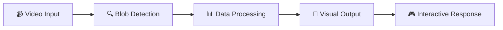

# 🎨 Blob Tracking i<div align="center">

# 🎨 Blob Tracking in TouchDesigner


</div>

<div align="center">
  <h3>🌟 A cutting-edge real-time blob tracking system built with TouchDesigner 🌟</h3>
  <p><em>Create interactive and generative visual experiences with advanced computer vision</em></p>
</div>

---

## 🚀 **Overview**

Transform your creative projects with this powerful blob tracking system that seamlessly integrates computer vision with TouchDesigner's robust visual programming environment. Perfect for interactive installations, motion capture applications, and generative art projects.

<table>
<tr>
<td width="50%">

### ✨ **Key Features**

- 🎯 **Advanced Blob Detection**  
  _Track moving objects with pixel-perfect precision_

- ⚡ **Real-time Processing**  
  _Ultra-low latency for live performances_

- 🎮 **Interactive Response System**  
  _Dynamic reactions to user input and stimuli_

- 🎨 **Customizable Visual Engine**  
  _Flexible parameters for any creative vision_

</td>
<td width="50%">

### 🔧 **Technical Stack**

- 🧠 **Computer Vision**  
  _Advanced tracking algorithms_

- 📊 **TouchDesigner Integration**  
  _TOPs & CHOPs data flow optimization_

- 🎬 **Multi-format Support**  
  _Various input sources compatibility_

- 🔄 **Performance Optimized**  
  _Smooth real-time operation_

</td>
</tr>
</table>

---

## 🎯 **How It Works**

<div align="center">
  


</div>

Our system leverages TouchDesigner's powerful **TOPs** (Texture Operators) and **CHOPs** (Channel Operators) to create a robust image processing pipeline. Advanced computer vision techniques ensure accurate blob tracking, making it ideal for:

- 🏛️ **Interactive Installations**
- 🎭 **Motion Capture Projects**
- 🎨 **Generative Art Applications**
- 🎪 **Live Performance Systems**

---

## 🚀 **Quick Start Guide**

<details>
<summary><b>📋 Prerequisites</b></summary>

- TouchDesigner 2022.32600 or later
- Compatible video input device (optional)
- Basic understanding of TouchDesigner workflow

</details>

### 📥 **Installation Steps**

```bash
# 1️⃣ Clone this repository
git clone https://github.com/DevxD98/Blobtracking.git

# 2️⃣ Navigate to the project directory
cd Blobtracking
```

### 🎬 **Setup Process**

| Step  | Action          | Description                                                                                                                                                                      |
| ----- | --------------- | -------------------------------------------------------------------------------------------------------------------------------------------------------------------------------- |
| **1** | 📁 **Download** | Get the `.toe` file from this repository                                                                                                                                         |
| **2** | 🚀 **Launch**   | Open with TouchDesigner (version 2022.32600+)                                                                                                                                    |
| **3** | 🗑️ **Remove**   | Delete the default file: <br/> |
| **4** | 📹 **Replace**  | Add your own video file for tracking                                                                                                                                             |

---

## 🎬 **Live Demo & Preview**

<div align="center">

### 🌟 **See It In Action**

[](https://github.com/user-attachments/assets/499e8e20-c939-4272-b717-b29ae6f7b131)

<br/>

**Click the preview below to see the full demo:**

[](https://github.com/user-attachments/assets/499e8e20-c939-4272-b717-b29ae6f7b131)

_🎯 Real-time blob tracking with dynamic visual feedback_

</div>

---

## 📚 **Documentation**

<details>
<summary><b>🔧 Configuration Options</b></summary>

- **Sensitivity Settings**: Adjust blob detection threshold
- **Visual Parameters**: Customize output effects and colors
- **Performance Tuning**: Optimize for your hardware setup
- **Input Sources**: Configure various video inputs

</details>

<details>
<summary><b>🎨 Customization Guide</b></summary>

- Modify visual effects in the TOP network
- Adjust tracking parameters in CHOP channels
- Create custom interaction responses
- Integrate with external systems via OSC/MIDI

</details>

---

## 🤝 **Contributing**

<div align="center">

**We ❤️ contributions from the community!**

[](https://github.com/DevxD98/Blobtracking/graphs/contributors)
[](https://github.com/DevxD98/Blobtracking/issues)
[](https://github.com/DevxD98/Blobtracking/pulls)

</div>

### 🌟 **How to Contribute**

1. 🍴 **Fork** the repository
2. 🌱 **Create** your feature branch (`git checkout -b feature/AmazingFeature`)
3. 💾 **Commit** your changes (`git commit -m 'Add some AmazingFeature'`)
4. 📤 **Push** to the branch (`git push origin feature/AmazingFeature`)
5. 🔄 **Open** a Pull Request

---

<div align="center">

### 🎉 **Join Our Community**

<p>
<a href="https://github.com/DevxD98/Blobtracking/issues"></a>
<a href="https://github.com/DevxD98/Blobtracking/fork"></a>
<a href="#"></a>
</p>

**Made with ❤️ by [DevxD98](https://github.com/DevxD98)**

_Happy Tracking! 🎯✨_

</div> TouchDesigner

> A real-time blob tracking system built with TouchDesigner for creating interactive and generative visual experiences.

## ✨ Features

- 👁️ **Blob Detection** - Track moving objects or shapes in real-time
- 🎮 **Dynamic Interaction** - Responsive system that reacts to user input and external stimuli
- 🎨 **Customizable Effects** - Flexible visual parameters for various use cases

## 🔧 How It Works

- 🔄 Leverages TouchDesigner's TOPs and CHOPs for robust image processing and data flow
- 📊 Implements blob tracking using advanced computer vision techniques
- 🎯 Perfect for interactive installations, motion capture, and generative art

## 🚀 Getting Started

1. Download the `.toe` file from this repository
2. Open with TouchDesigner (version 2022.32600 or later)
3. delete this file in the project -
4. Replace it with your own video file

## 📷 Output Preview

[](https://github.com/user-attachments/assets/499e8e20-c939-4272-b717-b29ae6f7b131)

## 🌟 Contributions

Feel free to fork this repository, explore the code, and suggest improvements! Contributions and feedback are always welcome. 😊
