<div align="center">

# 🎨 Blob Tracking in TouchDesigner


</div>

<div align="center">
  <h3>🌟 A cutting-edge real-time blob tracking system built with TouchDesigner 🌟</h3>
  <p><em>Create interactive and generative visual experiences with advanced computer vision</em></p>
</div>

---

## 🚀 **Overview**

> A real-time blob tracking system built with TouchDesigner for creating interactive and generative visual experiences.

Transform your creative projects with this powerful blob tracking system that seamlessly integrates computer vision with TouchDesigner's robust visual programming environment. Perfect for interactive installations, motion capture applications, and generative art projects.

---

## ✨ **Features**

<div align="center">
<table>
<tr>
<td width="50%">

### 🎯 **Core Capabilities**

- 👁️ **Advanced Blob Detection**  
  _Track moving objects or shapes in real-time_

- 🎮 **Dynamic Interaction**  
  _Responsive system that reacts to user input and external stimuli_

- 🎨 **Customizable Effects**  
  _Flexible visual parameters for various use cases_

</td>
<td width="50%">

### 🔧 **Technical Features**

- 🔄 **TouchDesigner Integration**  
  _Leverages TOPs and CHOPs for robust processing_

- 📊 **Computer Vision Engine**  
  _Advanced blob tracking algorithms_

- 🎯 **Multi-purpose Design**  
  _Perfect for installations, motion capture, and art_

</td>
</tr>
</table>
</div>

---

## 🛠️ **How It Works**

```mermaid
graph LR
    A[📹 Video Input] --> B[🔍 Blob Detection]
    B --> C[📊 Data Processing]
    C --> D[🎨 Visual Output]
    D --> E[🎮 Interactive Response]
```

<div align="center">
  


</div>

Our system utilizes TouchDesigner's powerful **TOPs** (Texture Operators) and **CHOPs** (Channel Operators) to create a robust image processing and data flow pipeline. Advanced computer vision techniques ensure accurate blob tracking, making it ideal for:

- 🏛️ **Interactive Installations**
- 🎭 **Motion Capture Projects**
- 🎨 **Generative Art Applications**
- 🎪 **Live Performance Systems**

---

## 🚀 **Getting Started**

<details>
<summary><b>📋 Prerequisites</b></summary>

- TouchDesigner 2022.32600 or later
- Compatible video input device (optional)
- Basic understanding of TouchDesigner workflow

</details>

### 📥 **Installation Steps**

```bash
# 1️⃣ Clone this repository
git clone https://github.com/DevxD98/Blobtracking.git

# 2️⃣ Navigate to the project directory
cd Blobtracking
```

### 🎬 **Setup Process**

| Step  | Action          | Description                                                                                                                                                                             |
| ----- | --------------- | --------------------------------------------------------------------------------------------------------------------------------------------------------------------------------------- |
| **1** | 📁 **Download** | Get the `.toe` file from this repository                                                                                                                                                |
| **2** | 🚀 **Launch**   | Open with TouchDesigner (version 2022.32600 or later)                                                                                                                                   |
| **3** | 🗑️ **Remove**   | Delete this file in the project:<br/> |
| **4** | 📹 **Replace**  | Replace it with your own video file                                                                                                                                                     |

---

## 🎬 **Output Preview**

<div align="center">

### 🌟 **See It In Action**

[](https://github.com/user-attachments/assets/499e8e20-c939-4272-b717-b29ae6f7b131)

<br/>

**Click the preview below to see the full demo:**

[](https://github.com/user-attachments/assets/499e8e20-c939-4272-b717-b29ae6f7b131)

_🎯 Real-time blob tracking with dynamic visual feedback_

</div>

---

## 📚 **Documentation**

<details>
<summary><b>🔧 Configuration Options</b></summary>

- **Sensitivity Settings**: Adjust blob detection threshold
- **Visual Parameters**: Customize output effects and colors
- **Performance Tuning**: Optimize for your hardware setup
- **Input Sources**: Configure various video inputs

</details>

<details>
<summary><b>🎨 Customization Guide</b></summary>

- Modify visual effects in the TOP network
- Adjust tracking parameters in CHOP channels
- Create custom interaction responses
- Integrate with external systems via OSC/MIDI

</details>

---

## 🌟 **Contributions**

<div align="center">

**We ❤️ contributions from the community!**

[](https://github.com/DevxD98/Blobtracking/graphs/contributors)
[](https://github.com/DevxD98/Blobtracking/issues)
[](https://github.com/DevxD98/Blobtracking/pulls)

</div>

Feel free to fork this repository, explore the code, and suggest improvements! Contributions and feedback are always welcome. 😊

### 🌟 **How to Contribute**

1. 🍴 **Fork** the repository
2. 🌱 **Create** your feature branch (`git checkout -b feature/AmazingFeature`)
3. 💾 **Commit** your changes (`git commit -m 'Add some AmazingFeature'`)
4. 📤 **Push** to the branch (`git push origin feature/AmazingFeature`)
5. 🔄 **Open** a Pull Request

---

<div align="center">

### 🎉 **Join Our Community**

<p>
<a href="https://github.com/DevxD98/Blobtracking/issues"></a>
<a href="https://github.com/DevxD98/Blobtracking/fork"></a>
<a href="#"></a>
</p>

**Made with ❤️ by [DevxD98](https://github.com/DevxD98)**

_Happy Tracking! 🎯✨_

</div>


